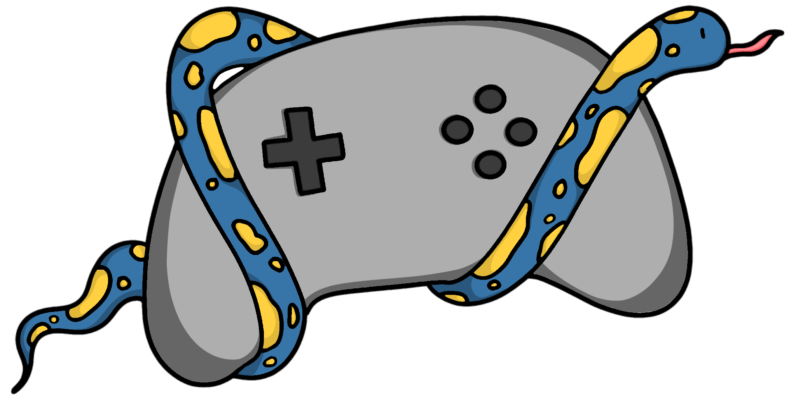

# gamePyd



Playing video games is fun isn't it? So why should making Python play games be any different ?
It should at least be easy! surely ? That's what this library here is for.
gamePyd provides readymade methods for common use cases. It also gives you the bricks it used as well, making reading and emulating xbox controllers trivial on Windows.

Under the hood, `nefarius`'s [ScpVBus](https://github.com/nefarius/ScpVBus) is wrapped to interact with XInput, which is in turn wrapped in methods to let you work with your preffered data structure
and seamlessly use the transformed information to control gamepads. Currently we support dataframes, lists and dictionaries.

## Prerequisites

This library should work with anything after Python 3.6, albeit testing has only been done on 3.8.4 and later. Currently the only supported OS is Windows 10.

To use the Virtual Controller object, you need `ScpVBus`. For ease [one of it's versions](https://github.com/shauleiz/vXboxInterface) is included in this project. More information about the original can be found at [nefarius's archived repo](https://github.com/nefarius/ScpVBus).
You'll probably also require [x360ce](https://www.x360ce.com/#Help_Old_Version) for easing the connection to games as well as debugging it. I've included it's older version as that's the one that worked for me. 

### Installing ScpVbus
We need ScpVBus to talk to Windows about gamepad related details:
Open an elevated cmd command prompt in the ScpVBus-x64 directory and run `devcon.exe install ScpVBus.inf Root\ScpVBus`. Successful run is indicated by the following message:

    Device node created. Install is complete when drivers are installed...
    Updating drivers for Root\ScpVBus from {Location}\PYXInput\ScpVBus-x64\ScpVBus.inf.
    Drivers installed successfully.

## Installing
Now that the basics are done, we ought to go throught the usual motions:

### Install via pip

    pip install gamePyd

### Are you in a rush?
Two main modules: 
- [writePad](/gamePyd/writePad.py) contains object [`wPad`] which you use to control (upto 4) virtual game pads
- - use the [`playMoment`](https://github.com/PCplays/gamePyd/blob/d722064054d5c74cbbd819ac97f5230ca21a40c1/gamepyd/writePad.py#L159) method to assign a state passed in as a dictionary
- - or pass in a dataframe with rows as states to [`playback`](https://github.com/PCplays/gamePyd/blob/d722064054d5c74cbbd819ac97f5230ca21a40c1/gamepyd/writePad.py#L188).
- To read gamepads(virtual or physical), you use the [`rPad`](https://github.com/PCplays/gamePyd/blob/d722064054d5c74cbbd819ac97f5230ca21a40c1/gamepyd/readPad.py#L55) object in [readPad](/gamePyd/readPad.py)
- - [`record`](https://github.com/PCplays/gamePyd/blob/d722064054d5c74cbbd819ac97f5230ca21a40c1/gamepyd/readPad.py#L144) will read the controller at a given  rate for a fixed duration, and return a dataframe.
- - [`capture`](https://github.com/PCplays/gamePyd/blob/d722064054d5c74cbbd819ac97f5230ca21a40c1/gamepyd/readPad.py#L168) will do the same, but instead terminate only on detecting a specified button press on the controller.

If you're not in a rush, please head to the [wiki pages](https://github.com/PCplays/gamePyd/wiki). If you'd like to request any features please raise an issue.

### Test the reading of controllers
Running `test_read()` should give (the output below was when no controller was plugged-in):

```
Testing controller in position 1:
This will just take a second. We'll look at the controller values in 200 milli-second intervals:
0---------------------------------------------
State:{'LT': 0, 'RT': 0, 'Lx': 0, 'Ly': 0, 'Rx': 0, 'Ry': 0, 'UP': False, 'DOWN': False, 'LEFT': False, 'RIGHT': False, 'START': False, 'SELECT': False, 'L3': False, 'R3': False, 'LB': False, 'RB': False, 'A': False, 'B': False, 'X': False,
 'Y': False}
---------------------------------------------
1---------------------------------------------
State:{'LT': 0, 'RT': 0, 'Lx': 0, 'Ly': 0, 'Rx': 0, 'Ry': 0, 'UP': False, 'DOWN': False, 'LEFT': False, 'RIGHT': False, 'START': False, 'SELECT': False, 'L3': False, 'R3': False, 'LB': False, 'RB': False, 'A': False, 'B': False, 'X': False,
 'Y': False}
---------------------------------------------
2---------------------------------------------
State:{'LT': 0, 'RT': 0, 'Lx': 0, 'Ly': 0, 'Rx': 0, 'Ry': 0, 'UP': False, 'DOWN': False, 'LEFT': False, 'RIGHT': False, 'START': False, 'SELECT': False, 'L3': False, 'R3': False, 'LB': False, 'RB': False, 'A': False, 'B': False, 'X': False,
 'Y': False}
---------------------------------------------
3---------------------------------------------
State:{'LT': 0, 'RT': 0, 'Lx': 0, 'Ly': 0, 'Rx': 0, 'Ry': 0, 'UP': False, 'DOWN': False, 'LEFT': False, 'RIGHT': False, 'START': False, 'SELECT': False, 'L3': False, 'R3': False, 'LB': False, 'RB': False, 'A': False, 'B': False, 'X': False,
 'Y': False}
---------------------------------------------
4---------------------------------------------
State:{'LT': 0, 'RT': 0, 'Lx': 0, 'Ly': 0, 'Rx': 0, 'Ry': 0, 'UP': False, 'DOWN': False, 'LEFT': False, 'RIGHT': False, 'START': False, 'SELECT': False, 'L3': False, 'R3': False, 'LB': False, 'RB': False, 'A': False, 'B': False, 'X': False,
 'Y': False}
---------------------------------------------
Better yet, you can use prettyRead() to sample as many times as desired for any required duration.
And then return it as a dataframe, can even write it to a file by supplying the filename.
    LT  RT  Lx  Ly  Rx  Ry     UP   DOWN   LEFT  RIGHT  START  SELECT     L3     R3     LB     RB      A      B      X      Y             time(ns)  timeDelta(ms)  error(ms)
0   0   0   0   0   0   0  False  False  False  False  False   False  False  False  False  False  False  False  False  False  1605620332292776700         9.9744   1.641067
1   0   0   0   0   0   0  False  False  False  False  False   False  False  False  False  False  False  False  False  False  1605620332301749900         8.9732   0.639867
2   0   0   0   0   0   0  False  False  False  False  False   False  False  False  False  False  False  False  False  False  1605620332310727300         8.9774   0.644067
3   0   0   0   0   0   0  False  False  False  False  False   False  False  False  False  False  False  False  False  False  1605620332319701900         8.9746   0.641267
4   0   0   0   0   0   0  False  False  False  False  False   False  False  False  False  False  False  False  False  False  1605620332328678100         8.9762   0.642867
Do note that the final three columns are metadata.
```

### Roadmap
Salient upcoming features are listed below (more details in the accompanying [project](https://github.com/PCplays/gamePyd/projects/2)):
- [ ] Calibration for machine-to-machine speed differences, so as to automatically minimize deviation from reading rate.
- [ ] Check for lag while writing to gamepads
- [ ] Add unit tests
- [ ] Expand the wiki

## Credits
* **Ayush Rawat** - *Main Developer* - [PCplays](https://github.com/PCplays)

* **Ryan Barnes** - *Authot of [PYXInput](https://github.com/bayangan1991/PYXInput)* - [bayangan1991](https://github.com/bayangan1991)

See also the list of [contributors](https://github.com/bayangan1991/PYXInput/graphs/contributors) who participated in PYXinput (from which this project was forked).

## Acknowledgments

* Everyone at [vJoy](http://vjoystick.sourceforge.net/site/) for the vXboxInterface DLL
* [nefarius](https://github.com/nefarius) for [ScpVBus](https://github.com/nefarius/ScpVBus)
